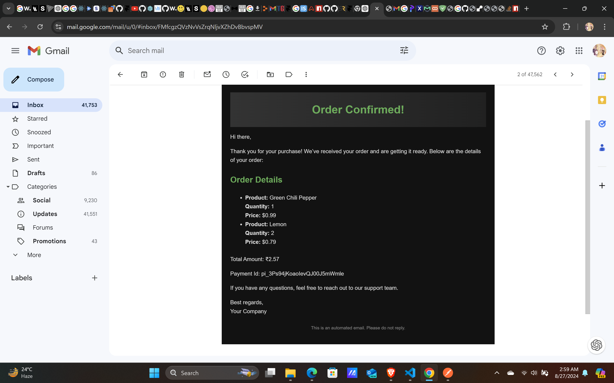

# eCommerceApp

eCommerceApp is a full-stack eCommerce application built with Node.js, Express, MongoDB, and React. The application provides a seamless shopping experience with features like user authentication, shopping cart management, order processing, payment integration with Stripe, and more.




## Features

- **User Authentication:** Secure user authentication with JWT, including features like signup, login, password reset, and email verification.
- **Shopping Cart:** Add, update, and remove items in the shopping cart with real-time calculations.
- **Order Management:** Users can place orders, and admins can view and manage orders. Order confirmation emails are sent to users upon successful order placement.
- **Payment Integration:** Integrated with Stripe for secure payments.
- **Invoice Download:** Users can download invoices for their orders as PDF files.
- **State Management:** Zustand is used for global state management, making the state logic simple and predictable.
- **Animations:** Framer Motion is used for smooth and modern animations throughout the application.
- **Responsive UI:** A modern and responsive user interface built with React and TailwindCSS.
- **API Documentation:** Swagger API documentation for backend endpoints.

## Technologies Used

- **Backend:**
  - Node.js
  - Express.js
  - MongoDB with Mongoose
  - JWT for authentication
  - Stripe for payment processing
  - Nodemailer for email notifications

- **Frontend:**
  - React.js
  - Vite.js
  - TailwindCSS
  - Zustand for state management
  - Framer Motion for animations
  - Axios for API requests

## Getting Started

### Prerequisites

- Node.js and npm installed on your machine
- MongoDB Atlas account or a local MongoDB instance
- Stripe account for payment integration

### Installation

1. Clone the repository:
   ```bash
   git clone https://github.com/Sujeethy/eCommerceApp.git
   ```
2. Navigate to the project directory:
   ```bash
   cd eCommerceApp
   ```
3. Install backend dependencies:
   ```bash
   npm install
   ```
4. Install frontend dependencies:
   ```bash
   cd frontend
   npm install
   ```

### Running the Application

1. Create a `.env` file in the root directory with the following environment variables:
   ```env
   MONGO_URI=<your-mongo-uri>
   PORT=5000
   JWT_SECRET=<your-jwt-secret>
   NODE_ENV=development
   CLIENT_URL=<your-client-url>

   MAIL_ID=<your-email-id>
   MAIL_PASSWORD=<your-email-password>

   STRIPE_SERVER=<your-stripe-secret-key>
   ```
2. Start the backend server:
   ```bash
   npm run dev
   ```
3. Start the frontend development server:
   ```bash
   cd frontend
   npm run dev
   ```
4. Access the application in your browser at `http://localhost:5173`.

### API Documentation

Swagger API documentation is available at `http://localhost:5000/api-docs`.

## Contributing

Contributions are welcome! Please create a pull request for any enhancements or bug fixes.
```
